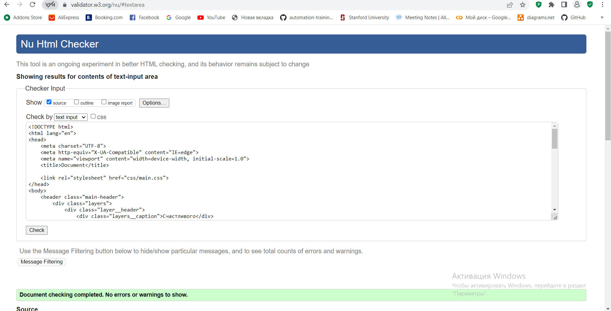

# Моя первая HTML страничка

## Задание:

Создать сайт (html-документ с названием index.html), с рассказом о чём угодно.

**Страница содержит:**

1. Два заголовка.

2. Два абзаца (параграфа).

3. Две картинки из интернета, которые находятся в свободном доступе.

4. Одну картинку, которая будет браться локально. Все локальные картинки должны храниться в папке img, которая должна лежать рядом с html-документом.

5. Один нумерованный список со значениями.

6. Один маркированный список со значениями.

7. Две ссылки.

8. Один локальный, подключенный css-файл, в котором прописаны пара стилей, применяемых на странице.

## Результат:

**Примечание:**

html-документ не должен содержать ошибок при проверке в [validator](https://validator.w3.org/#validate_by_input).

